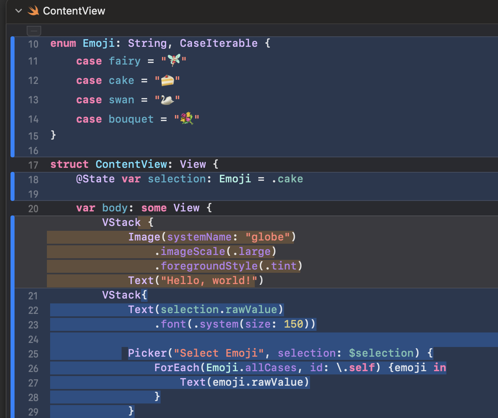

# Entry 2
##### 12/11/23

Content: 
I have been trying different tutorial exercises to learn Swift. I made [Emojis](../tool/Emojis), Contact page, watched youtube crash courses.

This is my code moments before I transfer my data onto a GitHub repository.

[Open Weather API](https://openweathermap.org/api) is a good app that could be used for location, although it might not be necassary for what the app I want to create.

Another cool thing is that images can seen from different angles. I tries this with a picture I found on Pinterest. To do this, I need to have a file that will be used for that. After I have added my Pinterest image as a file, I write an Image(_:) initializer, to pass it the name of the image to display. I could use styling`.clipShape(...)` to make the image viewed as a certain shape.
To change the frame/stroke I used `Circle().stroke(.white, lineWidth: 4)

Engineering Development Progress:
I am currently in the Engineering Design Process stages 2 and 3. I am researching the tool that will be used to create my app and see what properties may contribute to my app. So far, the styling part is most useful, especially how to make images pop out, and having a contract link clickable.

Skills:
Along learning a new programming language, I am strengthening my skill of How to Google. I use the internet to study my tool and cover any of the knowledge gap. Additionally, I am working on my logical reasoning 

FP goal for winter break
<!-- SwiftIU inspector with figma -->

[Previous](entry01.md) | [Next](entry03.md)

[Home](../README.md)
